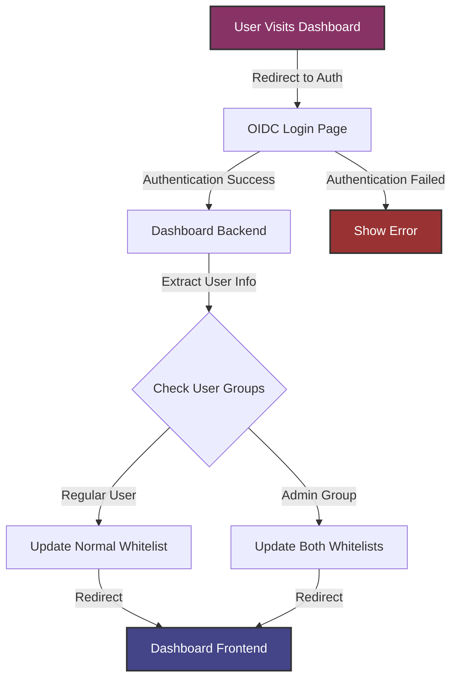
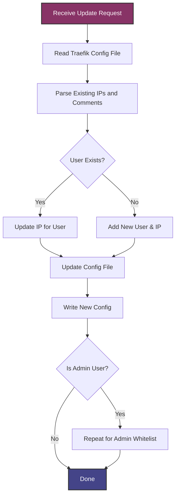

# Auth flow

```mermaid
flowchart TD
    A[User Visits Dashboard] -->|Redirect to Auth| B[OIDC Login Page]
    B -->|Authentication Success| C[Dashboard Backend]
    B -->|Authentication Failed| H[Show Error]
    C -->|Extract User Info| D{Check User Groups}
    D -->|Regular User| E[Update Normal Whitelist]
    D -->|Admin Group| F[Update Both Whitelists]
    E -->|Redirect| G[Dashboard Frontend]
    F -->|Redirect| G
    
    style A fill:#836,stroke:#333,stroke-width:2px,color:#fff
    style G fill:#448,stroke:#333,stroke-width:2px,color:#fff
    style H fill:#933,stroke:#333,stroke-width:2px,color:#fff
```

# IP Update flow

```mermaid
flowchart TD
    A[Receive Update Request] --> B[Read Traefik Config File]
    B --> C[Parse Existing IPs and Comments]
    C --> D{User Exists?}
    D -->|Yes| E[Update IP for User]
    D -->|No| F[Add New User & IP]
    E --> G[Update Config File]
    F --> G
    G --> H[Write New Config]
    H --> I{Is Admin User?}
    I -->|Yes| J[Repeat for Admin Whitelist]
    I -->|No| K[Done]
    J --> K
    
    style A fill:#836,stroke:#333,stroke-width:2px,color:#fff
    style K fill:#448,stroke:#333,stroke-width:2px,color:#fff
```
